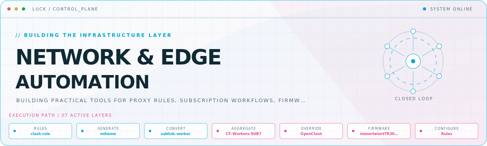
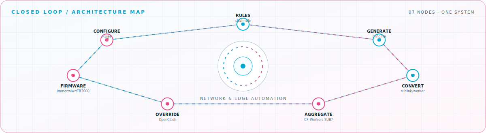

<picture>
  <source media="(prefers-color-scheme: dark)" srcset="assets/hero-dark.svg">
  <source media="(prefers-color-scheme: light)" srcset="assets/hero-light.svg">
  
</picture>

 

Building practical tools for proxy rules, subscription workflows, firmware automation, and home infrastructure\.

## Flagship systems

| Repository | Role | Purpose |
| --- | --- | --- |
| [`clash-rule`](https://github.com/LUCK777777/clash-rule)  | RULES | Self-maintained rule collection and templates for Clash\.Meta, Stash, Clash Verge, OpenClash, and Egern\. |
| [`mihome`](https://github.com/LUCK777777/mihome)  | GENERATE | Mihomo configuration generator that produces macOS, router, and Stash outputs from one source\. |
| [`sublink-worker`](https://github.com/LUCK777777/sublink-worker)  | CONVERT | Subscription conversion workflow for SingBox, Clash, V2Ray, and Xray\. |
| [`CF-Workers-SUB7`](https://github.com/LUCK777777/CF-Workers-SUB7)  | AGGREGATE | Cloudflare Workers-based subscription aggregation pipeline\. |
| [`immortalwrtTR3000`](https://github.com/LUCK777777/immortalwrtTR3000)  | BUILD | GitHub Actions workflow for building ImmortalWrt firmware for Cudy TR3000\. |
| [`OpenClash`](https://github.com/LUCK777777/OpenClash)  | OVERRIDE | OpenClash override files for repeatable network configuration\. |

## Closed-loop architecture

<picture>
  <source media="(prefers-color-scheme: dark)" srcset="assets/closed-loop-dark.svg">
  <source media="(prefers-color-scheme: light)" srcset="assets/closed-loop-light.svg">
  
</picture>

## Module registry

<strong>Configurations</strong> · 2 modules

| Module | Purpose |
| --- | --- |
| [`Rules`](https://github.com/LUCK777777/Rules) | Mihomo and Stash YAML configuration collection\. |
| [`ACL4SSR`](https://github.com/LUCK777777/ACL4SSR) | Maintained ACL4SSR rule-set fork for proxy routing\. |

<strong>Web &amp; media</strong> · 2 modules

| Module | Purpose |
| --- | --- |
| [`hexo`](https://github.com/LUCK777777/hexo) | Anzhiyu-based Hexo theme workspace\. |
| [`photo`](https://github.com/LUCK777777/photo) | Image asset repository for personal projects\. |

<a href="https://github.com/LUCK777777">GitHub</a>

<!-- Generated by profile-control-plane. Edit profile.yaml, not this file. -->
